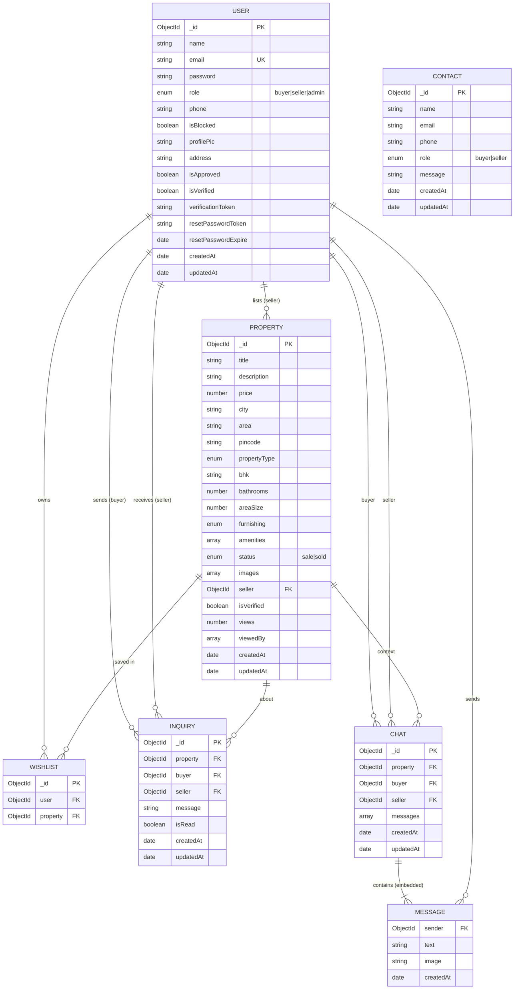
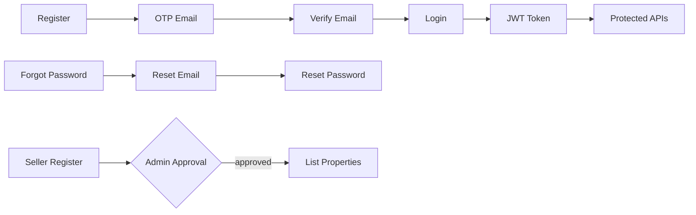
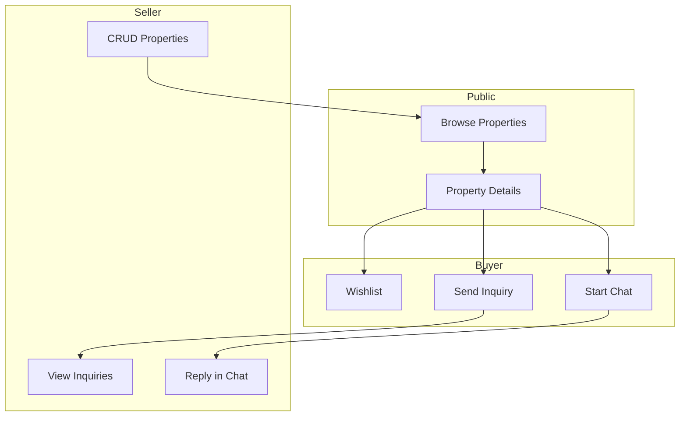

# Propertier Backend

REST API for **Propertier** — a property marketplace where buyers browse listings, sellers manage properties, and admins moderate the platform. Built with Node.js, Express, MongoDB, JWT auth, Nodemailer, and Cloudinary.

---

## Table of Contents

- [Project Progress](#project-progress-step-by-step)
- [Architecture](#architecture)
- [Entity-Relationship Diagrams](#entity-relationship-diagrams)
- [Data Models](#data-models)
- [API Reference](#api-reference)
- [Tech Stack](#tech-stack)
- [Environment Variables](#environment-variables)
- [Run Locally](#run-locally)
- [Testing Flow](#testing-flow)

---

## Project Progress (Step by Step)

### 1) Initial backend setup

- Express server (`server.js`) with `cors`, `express.json`, and `dotenv`.
- MongoDB connection via `config/db.js`.
- Health check: `GET /` → `API is working!`

### 2) Layered architecture


| Layer          | Responsibility                   |
| -------------- | -------------------------------- |
| `models/`      | Mongoose schemas                 |
| `controllers/` | Business logic                   |
| `middlewares/` | Auth, uploads, role guards       |
| `routes/`      | HTTP endpoint mapping            |
| `utils/`       | Email, Cloudinary upload helpers |
| `config/`      | DB and Cloudinary configuration  |


### 3) User model & authentication

- **User** schema: identity, roles (`buyer` | `seller` | `admin`), verification, password reset tokens.
- **Auth APIs**: register, login, verify email (OTP), forgot/reset password, `getMe`.
- **Middleware**: `protect` (JWT), `authorize(...roles)`.
- Email: migrated from Brevo API → **Nodemailer + Gmail SMTP** (App Password).

### 4) User profile module

- Get/update own profile (`GET/PUT /api/user/profile`).
- Profile picture upload via **Multer** → **Cloudinary**.
- Public profile by user ID (`GET /api/user/public/:id`).

### 5) Property module

- **Property** schema: listing details, images, seller reference, status (`sale` | `sold`), views.
- Sellers: create, update, delete, list own properties, dashboard, status patch.
- Public: list all, details, counts.

### 6) Wishlist module

- Buyers save/remove properties; list wishlist.

### 7) Inquiry module

- Buyers send inquiries on a property; sellers view and mark as read.

### 8) Contact module

- Public contact form submissions; admin can list all contacts.

### 9) Admin module

- Admin-only routes: users, block/delete, properties, inquiries, stats, pending seller approval.

### 10) Chat module

- Buyer–seller chats tied to a property; send/list/delete messages and chats (JWT protected).

### 11) End-to-end testing

Auth, user, property, wishlist, inquiry, contact, admin, and chat APIs validated in Postman during local development.

---

## Architecture

```
Client (React / Postman)
        │
        ▼
   Express Server
        │
   ┌────┴────┬──────────┬────────────┐
   ▼         ▼          ▼            ▼
 protect  authorize   multer    sendEmail
   │         │          │            │
   ▼         ▼          ▼            ▼
Controllers ──────► Mongoose ──► MongoDB
                         │
                    Cloudinary (images)
```

**Request flow:** `Route` → `protect` / `authorize` → `Controller` → `Model` → response.

---

## Entity-Relationship Diagrams

MongoDB stores documents; relationships use `ObjectId` references (`ref`). Embedded subdocuments are shown where applicable.

### High-level ER diagram




### Relationship summary


| From     | To       | Cardinality | Description                                    |
| -------- | -------- | ----------- | ---------------------------------------------- |
| User     | Property | 1 : N       | A seller owns many listings (`seller` field)   |
| User     | Wishlist | 1 : N       | A user has many wishlist entries               |
| Property | Wishlist | 1 : N       | A property can appear in many users' wishlists |
| User     | Inquiry  | 1 : N       | Buyer sends inquiries; seller receives them    |
| Property | Inquiry  | 1 : N       | Each inquiry is for one property               |
| User     | Chat     | 1 : N       | User participates as buyer or seller in chats  |
| Property | Chat     | 1 : N       | Optional context for a conversation            |
| Chat     | Message  | 1 : N       | Messages embedded in `Chat.messages[]`         |
| Contact  | —        | —           | Standalone; no FK to User                      |


### Auth & account lifecycle (conceptual)




### Property & buyer interaction




---

## Data Models

### User


| Field                 | Type    | Notes                           |
| --------------------- | ------- | ------------------------------- |
| name, email, password | String  | email unique                    |
| role                  | Enum    | `buyer`, `seller`, `admin`      |
| isVerified            | Boolean | email OTP verified              |
| isApproved            | Boolean | sellers may need admin approval |
| isBlocked             | Boolean | blocks login / protected routes |
| verificationToken     | String  | 6-digit OTP                     |
| resetPasswordToken    | String  | hashed token for reset link     |
| resetPasswordExpire   | Date    | reset link expiry               |


### Property


| Field        | Type     | Notes                               |
| ------------ | -------- | ----------------------------------- |
| seller       | ObjectId | ref `User`                          |
| propertyType | Enum     | flat, villa, plot, commercial, etc. |
| status       | Enum     | `sale`, `sold`                      |
| images       | String[] | Cloudinary URLs                     |
| views        | Number   | view counter                        |


### Wishlist


| Field    | Type     | Notes          |
| -------- | -------- | -------------- |
| user     | ObjectId | ref `User`     |
| property | ObjectId | ref `Property` |


### Inquiry


| Field    | Type     | Notes             |
| -------- | -------- | ----------------- |
| property | ObjectId | ref `Property`    |
| buyer    | ObjectId | ref `User`        |
| seller   | ObjectId | ref `User`        |
| message  | String   | inquiry text      |
| isRead   | Boolean  | seller read state |


### Contact

Standalone form data (`name`, `email`, `phone`, `role`, `message`) — not linked to registered users.

### Chat (embedded Message)


| Chat field | Type     | Notes                    |
| ---------- | -------- | ------------------------ |
| property   | ObjectId | optional listing context |
| buyer      | ObjectId | ref `User`               |
| seller     | ObjectId | ref `User`               |
| messages[] | Array    | embedded subdocuments    |


Each **Message**: `sender` (User), `text`, optional `image`, `createdAt`.

---

## API Reference

Base URL: `http://localhost:5000`

Protected routes require header: `Authorization: Bearer <token>`

### Auth — `/api/auth`


| Method | Endpoint                 | Auth | Description          |
| ------ | ------------------------ | ---- | -------------------- |
| POST   | `/register`              | —    | Register + OTP email |
| POST   | `/login`                 | —    | Login, returns JWT   |
| GET    | `/me`                    | ✓    | Current user         |
| POST   | `/verify-email`          | —    | Verify OTP           |
| POST   | `/forgot-password`       | —    | Send reset email     |
| POST   | `/reset-password/:token` | —    | Reset password       |


### User — `/api/user`


| Method | Endpoint      | Auth | Description           |
| ------ | ------------- | ---- | --------------------- |
| GET    | `/profile`    | ✓    | Own profile           |
| PUT    | `/profile`    | ✓    | Update (+ profilePic) |
| GET    | `/public/:id` | —    | Public profile        |


### Property — `/api/property`


| Method | Endpoint            | Auth / Role | Description        |
| ------ | ------------------- | ----------- | ------------------ |
| GET    | `/`                 | —           | All properties     |
| GET    | `/counts`           | —           | Property counts    |
| GET    | `/:id`              | —           | Property details   |
| POST   | `/`                 | seller      | Create listing     |
| GET    | `/me`               | seller      | My listings        |
| POST   | `/:id`              | seller      | Update listing     |
| DELETE | `/:id`              | seller      | Delete listing     |
| PATCH  | `/:id/status`       | seller      | Update sale status |
| GET    | `/seller/dashboard` | seller      | Seller dashboard   |


### Wishlist — `/api/wishlist`


| Method | Endpoint       | Auth | Description     |
| ------ | -------------- | ---- | --------------- |
| POST   | `/:propertyId` | ✓    | Add to wishlist |
| GET    | `/`            | ✓    | Get wishlist    |
| DELETE | `/:propertyId` | ✓    | Remove item     |


### Inquiry — `/api/inquiry`


| Method | Endpoint    | Auth / Role | Description      |
| ------ | ----------- | ----------- | ---------------- |
| POST   | `/`         | buyer       | Send inquiry     |
| GET    | `/seller`   | seller      | Seller inquiries |
| PATCH  | `/:id/read` | ✓           | Mark as read     |


### Contact — `/api/contact`


| Method | Endpoint | Auth / Role | Description         |
| ------ | -------- | ----------- | ------------------- |
| POST   | `/`      | —           | Submit contact form |
| GET    | `/`      | admin       | List all contacts   |


### Admin — `/api/admin`

All routes require **admin** role.


| Method | Endpoint              | Description     |
| ------ | --------------------- | --------------- |
| GET    | `/users`              | All users       |
| PATCH  | `/user/:id/block`     | Block user      |
| DELETE | `/user/:id`           | Delete user     |
| GET    | `/properties`         | All properties  |
| DELETE | `/properties/:id`     | Delete property |
| GET    | `/inquiries`          | All inquiries   |
| GET    | `/stats`              | Dashboard stats |
| GET    | `/pending-seller`     | Pending sellers |
| PATCH  | `/approve-seller/:id` | Approve seller  |


### Chat — `/api/chat`

All routes require authentication.


| Method | Endpoint                      | Description        |
| ------ | ----------------------------- | ------------------ |
| POST   | `/`                           | Start chat         |
| POST   | `/send`                       | Send message       |
| GET    | `/user`                       | User's chats       |
| GET    | `/:chatId`                    | Chat messages      |
| DELETE | `/:chatId`                    | Delete chat        |
| DELETE | `/:chatId/message/:messageId` | Delete one message |


---

## Tech Stack


| Category     | Tools                          |
| ------------ | ------------------------------ |
| Runtime      | Node.js (ES Modules)           |
| Framework    | Express 5                      |
| Database     | MongoDB + Mongoose             |
| Auth         | JWT, bcrypt                    |
| Email        | Nodemailer (SMTP)              |
| File uploads | Multer, Cloudinary             |
| Real-time    | socket.io (dependency present) |
| Dev          | nodemon                        |


---

## Environment Variables

Create `backend/.env`:

```env
PORT=5000
MONGO_URI=your_mongodb_connection_string
JWT_SECRET=your_jwt_secret

# Email (Gmail SMTP + App Password)
SMTP_HOST=smtp.gmail.com
SMTP_PORT=587
SMTP_USER=your_email@gmail.com
SMTP_PASS=your_16_char_google_app_password
EMAIL_FROM=your_email@gmail.com

# Cloudinary (property & profile images)
CLOUDINARY_NAME=your_cloud_name
CLOUDINARY_KEY=your_api_key
CLOUDINARY_SECRET=your_api_secret
```

**Gmail:** use a [Google App Password](https://myaccount.google.com/apppasswords), not your normal Gmail password.

---

## Run Locally

```bash
cd backend
npm install
npm start
```

Server: `http://localhost:5000`

---

## Testing Flow

### Auth

1. `POST /api/auth/register`
2. Verify OTP from email
3. `POST /api/auth/verify-email`
4. `POST /api/auth/login` → copy token
5. `GET /api/auth/me` with `Authorization: Bearer <token>`

### Seller property flow

1. Register/login as **seller** (admin approval if pending)
2. `POST /api/property` with images (multipart)
3. `GET /api/property/me`
4. `PATCH /api/property/:id/status`

### Buyer flow

1. `GET /api/property`
2. `POST /api/wishlist/:propertyId`
3. `POST /api/inquiry` (buyer role)
4. `POST /api/chat` → `POST /api/chat/send`

### Admin

1. Login as **admin**
2. `GET /api/admin/stats`
3. `GET /api/admin/pending-seller` → `PATCH /api/admin/approve-seller/:id`

---

## Project Structure

```
backend/
├── config/
│   ├── db.js
│   └── cloudinary.js
├── controllers/
│   ├── auth.controller.js
│   ├── user.controller.js
│   ├── property.controller.js
│   ├── wishlist.controller.js
│   ├── inquiry.controller.js
│   ├── contact.controller.js
│   ├── admin.controller.js
│   └── chat.controller.js
├── middlewares/
│   ├── auth.middleware.js
│   └── upload.middleware.js
├── models/
│   ├── user.model.js
│   ├── property.model.js
│   ├── wishlist.model.js
│   ├── inquiry.model.js
│   ├── contact.model.js
│   └── chat.model.js
├── routes/
├── utils/
│   ├── sendEmail.js
│   └── uploadToCloudinary.js
├── server.js
└── README.md
```

---

## Next Steps

- Input validation (e.g. Joi/Zod) on all endpoints
- Automated API tests
- Socket.io wiring for live chat
- Rate limiting and API versioning

